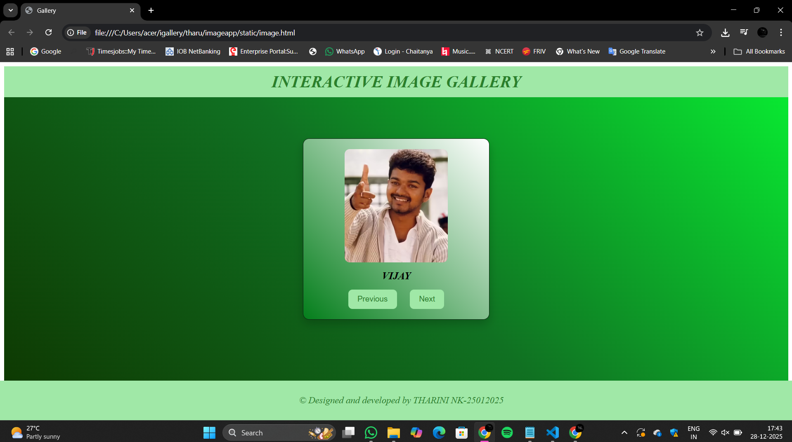
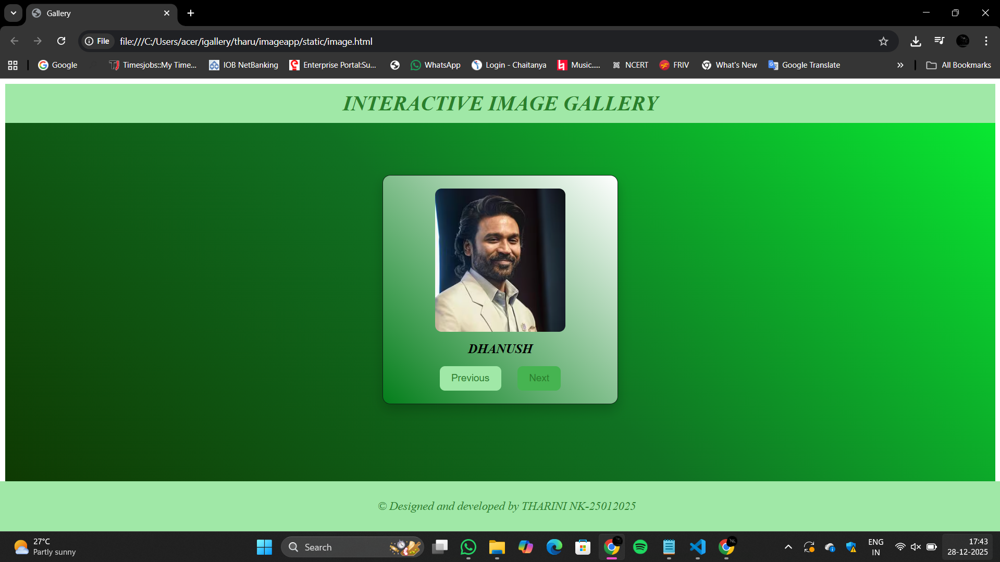
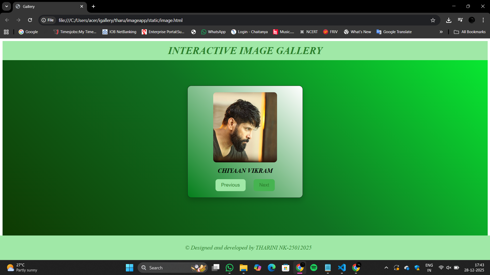
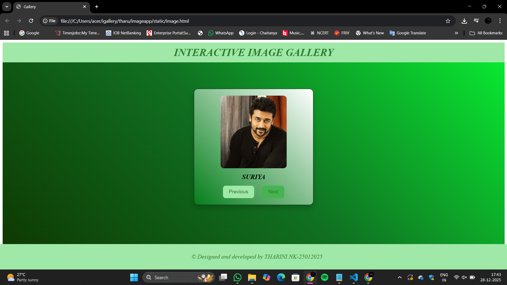
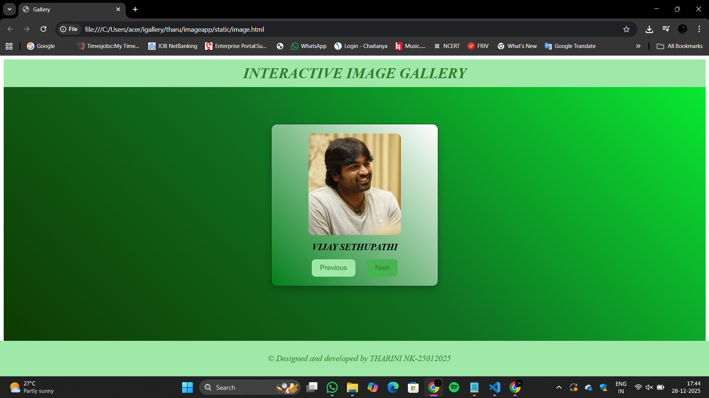

# Ex.07 Design of Interactive Image Gallery
## Date: 28-12-2025

## AIM:
To design a web application for an inteactive image gallery for a minimum five images with next and previous buttons.

## DESIGN STEPS:

### Step 1:
Clone the github repository and create Django admin interface.

### Step 2:
Change settings.py file to allow request from all hosts.

### Step 3:
Use CSS for positioning and styling.

### Step 4:
Write JavaScript program for implementing interactivity.

### Step 5:
Validate the HTML and CSS code.

### Step 6:
Publish the website in the given URL.

## PROGRAM:
```
image.html
<html>
<head>
    <title>Gallery</title>
    <link rel="stylesheet" href="image.css">

    <script>
        const gallery = [
            { src: "photo_1.avif", caption: "VIJAY" },
            { src: "Dhanush.avif", caption: "DHANUSH" },
            { src: "chiyaan-vikram.jpg", caption: "CHIYAAN VIKRAM" },
            { src: "Rajinikanth-.webp", caption: "RAJINIKANTH" },
            { src: "Suriya.avif", caption: "SURIYA" },
            { src: "Vijay_Sethupathi.avif", caption: "VIJAY SETHUPATHI" }
        ];

        let index = 0;

        function updateImage()
         {
            document.getElementById("img").src = gallery[index].src;
            document.getElementById("text").innerHTML = gallery[index].caption;
        }

        function next()
         {
            index++;
            if(index >= gallery.length){
               index = 0;
             }
            updateImage();
        }

        function previous()
         {
            index--;
            if(index < 0){
               index = gallery.length - 1;
            }
            updateImage();
        }
    </script>
</head>
<body>
    <i>
    <div class="bg">
        <div class="title">
        <h1>INTERACTIVE IMAGE GALLERY</h1>
        </div>
         <div class="box">
             <div class="image">
                 
                 <h2 id="text">VIJAY</h2>
                 <div class="button1">
                    <button onclick="previous()">Previous</button>
                    <button onclick="next()">Next</button>
                </div>
              </div>
        </div> 
         <footer class="copyrights">
             <p> &copy; Designed and developed by THARINI NK-25012025 </p>
        </footer>
    </div>
   
    </i>
    
</body>
</html>

image.css
.title 
{
    height: 60px;
    width: 100%;
    background-color:rgb(160, 232, 167);
    color: rgb(42, 128, 43);
    text-align: center;
    line-height: 60px;
}
.bg
{
    background: linear-gradient(45deg,rgb(14, 54, 0),rgb(16, 113, 34),rgb(8, 239, 50));
    height: 100%;
    width: 100%;
}
.box
 {
    display: flex;
    justify-content: center;
    align-items: center;
    margin-top: 80px;
}

.image 
{
    width: 320px;
    background: linear-gradient(45deg,rgb(4, 126, 27),white);
    border: 1px solid rgb(14, 33, 20);
    border-radius: 12px;
    padding: 20px;
    box-shadow: 0 8px 18px rgba(0, 0, 0, 0.2);

    display: flex;
    flex-direction: column;
    align-items: center;
    gap: 15px;
}

.image img
 {
    height: 220px;
    width: 200px;
    border-radius: 10px;
    object-fit: cover;
}

.image h2 
{
    font-size: 20px;
    margin: 0;
    text-align: center;
}

.button1 
{
    display: flex;
    gap: 25px;
}

button 
{
    background-color: rgb(160, 232, 167);
    color:rgb(42, 128, 43);
    padding: 10px 18px;
    font-size: 15px;
    border: none;
    border-radius: 8px;
    cursor: pointer;
}

button:hover
 {
    background-color: rgb(70, 180, 81);
}

.copyrights
 {
    background-color:  rgb(160, 232, 167);
    color: rgb(42, 128, 43);
    padding: 10px;
    position: fixed;
    bottom: 0;
    width: 100%;
    font-size: 18px;
    text-align: center;
    left: 0;
}
```

## OUTPUT:











## RESULT:
The program for designing an interactive image gallery using HTML, CSS and JavaScript is executed successfully.
